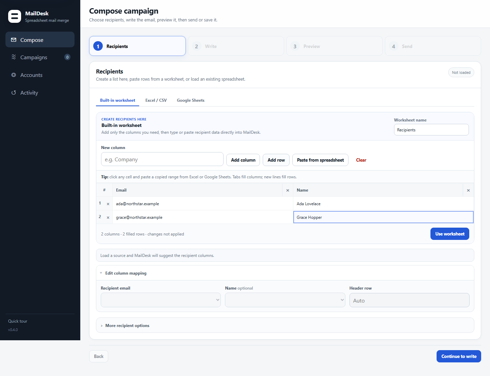
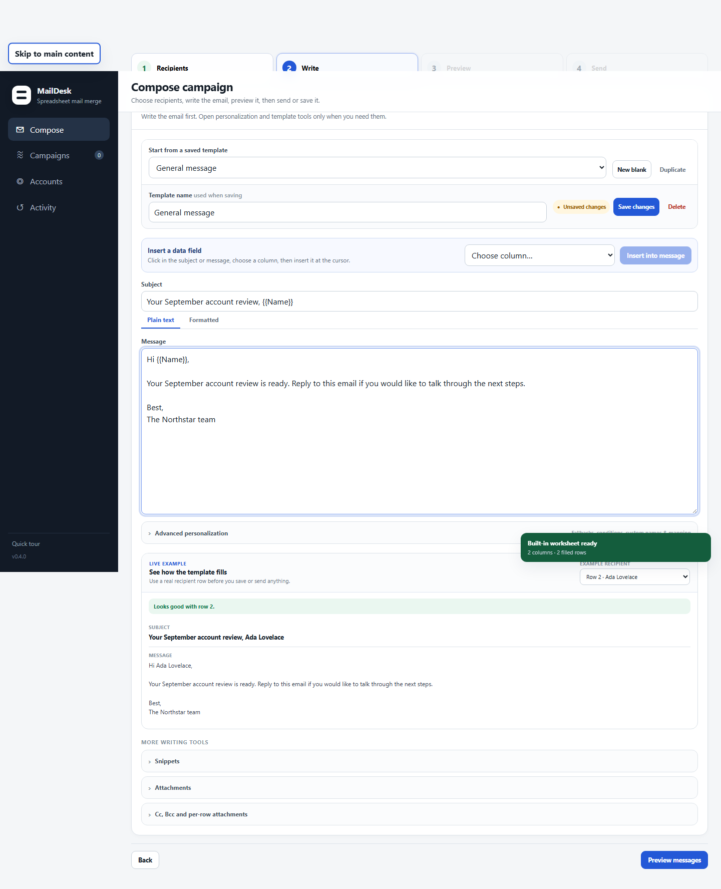
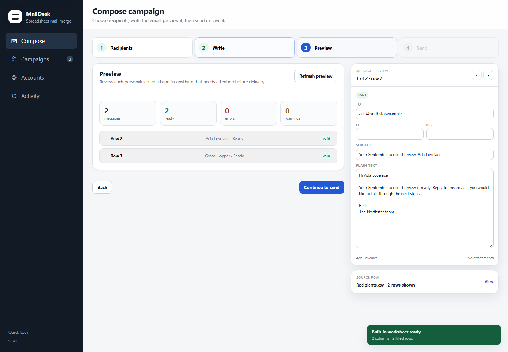
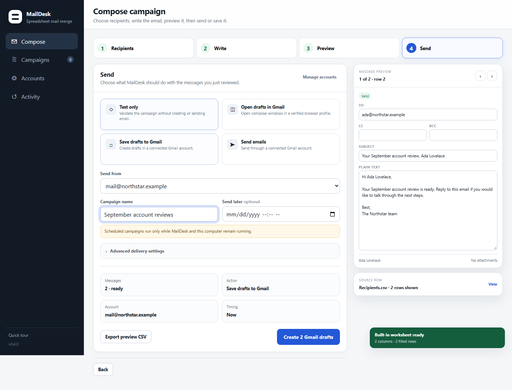
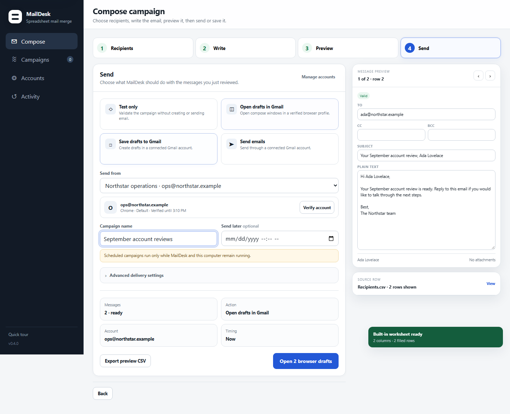
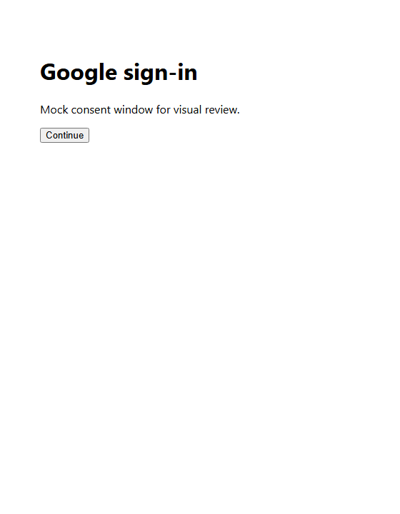
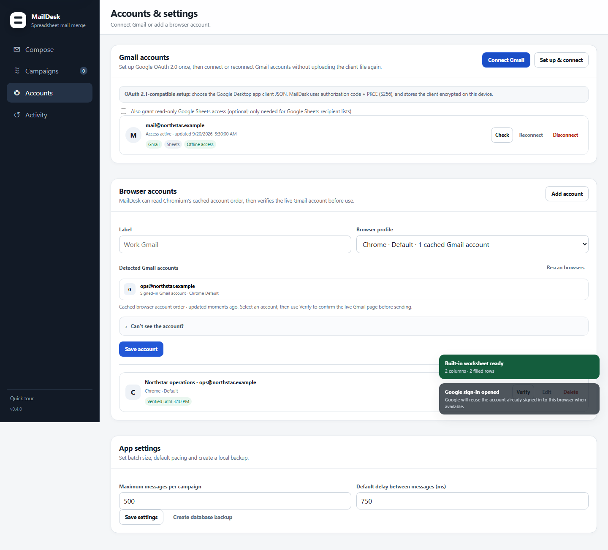

# User Guide

On a fresh install, MailDesk opens a short guided tour. You can replay it any time with **Quick tour** in the sidebar.

## The everyday flow

MailDesk is designed around one short decision path: choose recipients, write one reusable message, review the generated emails, then choose a delivery method. The optional controls stay collapsed until you need them.

### Start with recipients

Use the built-in worksheet for a small campaign, or choose a file or Google Sheet for an existing list. Confirm the recipient-email column, then continue.



## 1. Recipients

Load an Excel/CSV file or a Google Sheet. Confirm the worksheet, header row and recipient-email column. MailDesk suggests common mappings automatically.

Use **More recipient options** only when you need Cc/Bcc columns, filtering, sorting or a row limit. You can select rows and make campaign-only cell edits without changing the original spreadsheet.

## 2. Write

Choose a saved template or click **New blank**. Give reusable messages a clear **Template name**; MailDesk shows whether the template is saved or has unsaved changes, and warns before switching away from unsaved work. Use **Duplicate** when you want to make a variant without changing the original.

Write the subject and message normally. For a simple field, use **Insert a data field**. For fallbacks, conditions, or custom mapping, open **Advanced personalization**.

1. Choose the spreadsheet column under **Fill from**.
2. Add a **Fallback if blank** when an empty value should still produce a natural message, such as `there` for a first-name greeting.
3. Choose where to insert it: **Message**, **Subject**, **Cc**, or **Bcc**.
4. Click **Insert field**. MailDesk creates the safe template token and remembers which sheet column fills it.

The generated token remains compatible with MailDesk's template language, for example `{{FirstName|there}}`. **Use a custom field name** is available when you want a reusable field name that differs from the spreadsheet header. **Only show when filled** inserts a conditional block for optional content.

The **Fields used in this template** section shows every field, its source column, fallback, and a sample value. Use **Auto-match columns** when loading a template whose field names differ from the current sheet.

The **Live example** panel fills the template with a real spreadsheet row while you edit it. Change **Example recipient** to test another row. Resolve any “Needs mapping” or blank-value warning before saving or continuing. This is the fastest way to check that greetings, company names, links, and other personalized fields read naturally.



Snippets, attachments, formatted HTML, signatures and Cc/Bcc options remain available under **More writing tools**.

## 3. Preview

MailDesk automatically prepares personalized messages for manageable batches as you edit. Open **Preview** to inspect the generated result for every selected row. Use **Refresh preview** when you explicitly want to rebuild it. Fix blocking errors before continuing; one-off recipient/message edits can still be made from the message preview.



## 4. Send

Choose one delivery action:

- **Test only** — validate the campaign without creating or sending email.
- **Open drafts in Gmail** — open reviewed compose windows in a verified browser account.
- **Save drafts to Gmail** — create drafts through a connected Gmail account.
- **Send emails** — send through a connected Gmail account.

Campaign name, schedule, pacing and duplicate handling are optional. Scheduled work requires MailDesk and the computer to remain running. Live sending opens a confirmation dialog that names the selected account and recipient count; choose **Send emails** there to proceed.

### Choose the right delivery path

Use a **Gmail API account** when you want MailDesk to save drafts or send mail through the Gmail API. The account is connected once with the OAuth popup and can be reused for later campaigns.



Use **Open drafts in Gmail** when you prefer Gmail’s normal compose window. MailDesk opens the configured local browser profile and Gmail account slot; it requires a recent verification of that account before it creates drafts.



## Campaigns

Use **Campaigns** to inspect active, scheduled and completed campaigns, pause or resume work, retry failed messages, cancel a campaign, and inspect row-level results.

If Gmail returns an uncertain result during a draft or send operation, MailDesk pauses the affected item instead of guessing. Check Gmail, then mark the item as completed or not completed before resuming.

## Gmail accounts

Open **Accounts → Gmail accounts**. On first setup, choose **Set up & connect** and select a Google OAuth **Desktop app** JSON file. MailDesk encrypts and remembers that client configuration locally. After the first setup, use **Connect Gmail** to add another account without choosing the JSON again.

The sign-in opens in a dedicated popup. If the browser already has a Google session, Google may offer that account, but you still approve the OAuth connection explicitly.



Leave **Google Sheets access** enabled when you want that account to load Sheet snapshots. Existing accounts show:

- **Check** — refresh credentials if necessary and verify the live Gmail account identity.
- **Reconnect** — repeat authorization for the same expected email address, preserving an existing Sheets grant unless you explicitly reconnect without it from a clean account.
- **Disconnect** — remove the account from MailDesk locally. This is intentionally different from revoking the Google authorization.

If the saved Desktop OAuth client becomes invalid or is replaced, choose **Use another OAuth client**. Forgetting the reusable client does not disconnect accounts that are already stored because each account retains the encrypted client that issued its refresh token.

## Browser accounts

Open **Accounts → Browser accounts** and choose a browser profile. MailDesk reads that profile and, when Chromium has cached the signed-in Google session, lists Gmail accounts in browser order so the account index and email can be filled automatically. Click **Rescan browsers** after signing in or changing accounts; manual account-index/email entry remains available as a fallback.

Browser drafts are optional. If MailDesk cannot detect a compatible Chrome, Edge, or Brave profile—or its executable/user-data folder moved—**Open drafts in Gmail** stays unavailable until you rescan and select a working profile. Use **Save drafts to Gmail** or **Send emails** with a connected Gmail API account instead. MailDesk launches the exact browser executable, user-data folder, and profile you selected. If that launch fails, it offers to open Gmail in your system default browser only for recovery; sign in there, rescan, and verify the configured profile before opening drafts.

```text
Chrome · Profile 1 · account 0 · personal@example.com
Chrome · Profile 1 · account 1 · work@example.com
```

Use **Verify** before browser processing. The account index follows Gmail's signed-in account order, so verify again if that order changes or the verification expires.


